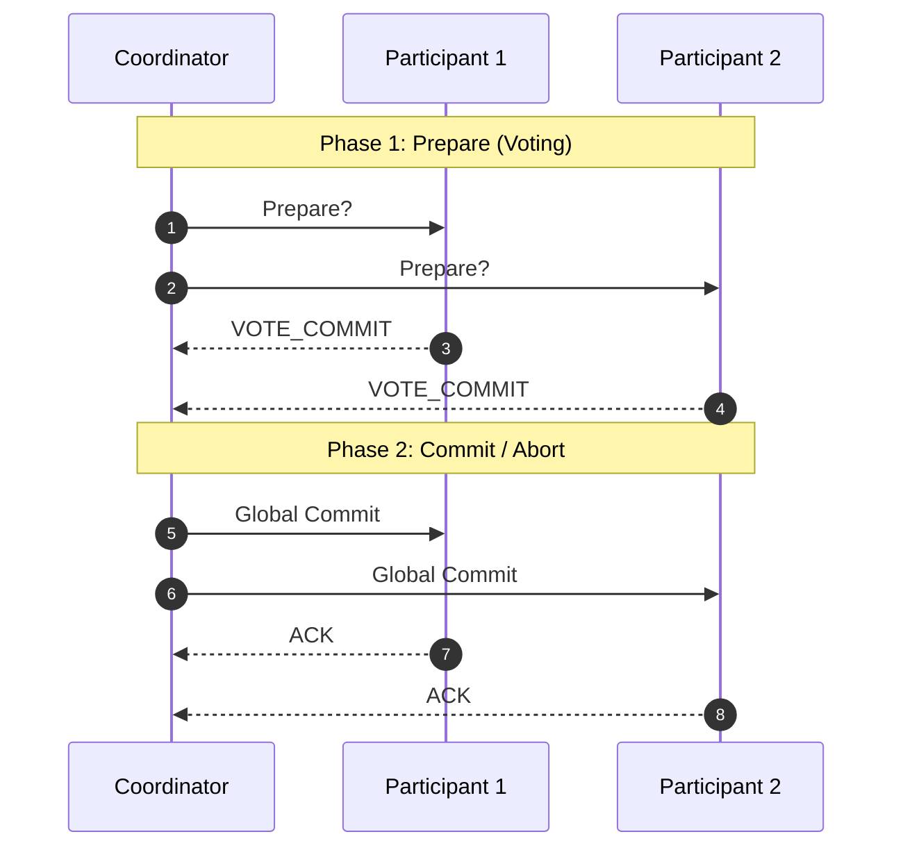

---
title: "Distributed Systems: Fundamentals, Transactions, and Consensus"
date: 2026-10-05 11:20:10 +05:30
categories: [Distributed Systems, System Design]
tags: [distributed-systems, transactions, consensus, paxos, 2pc, mvcc, cap-theorem, logical-clocks]
math: true
mermaid: true
---

A complete set of notes covering the core concepts of distributed systems, basic theorems, distributed transactions, isolation models, consensus algorithms like Paxos and Multi-Paxos, and time/logical clocks.

---

## Chapter 1 — Distributed Systems Fundamentals

### 1. What is a Distributed System?

A **distributed system** consists of components located on different networked computers that communicate and coordinate their actions by passing messages to one another.

### 2. Why Use Distributed Systems?

* **Performance:** Overcome single-hardware limitations.
* **Scalability:** Split, store, and distribute data and traffic across multiple nodes.
* **Availability:** Provide redundancy using multiple nodes.

### 3. Fallacies of Distributed Systems

Key challenges stem from network unreliability and clock desynchronization.

### 4. Why Distributed Systems Are Hard

* Network asynchrony
* Partial failures
* Inherent concurrency

### 5. Correctness in Distributed Systems

Properties that must be satisfied by the system:

* **Safety Properties:** "Bad things should never happen" (e.g., money shouldn't be deducted twice).
* **Liveness Properties:** "Good things should happen eventually" (e.g., once the network comes back, complete payment or refund clearly).

### 6. System Models

Assumptions made about how a distributed system behaves. They define the environmental rules for algorithms across 4 dimensions:

1. **Timing Model:** How nodes communicate with each other.
2. **Fault Model:** How nodes fail.
3. **Network Model:** How messages behave.
4. **Clock Assumptions:** Synchronous vs. asynchronous clocks.

### 7. Exactly-Once Semantics

Addresses the issue of processing a message twice or not processing it at all.

* **Solutions:**
  1. Idempotent operations
  2. De-duplication mechanisms
* **Delivery vs Processing:**
  1. *Delivery:* Outside full control due to network reliability and stability.
  2. *Processing:* Under internal control within application bounds.

### 8. Failure Detection

It is difficult to identify failures due to asynchronous networks (hard to distinguish a dead node from a slow node).

* **Timeouts (Trade-offs):**
  * *Small timeout:* Early detection, but risks false positives (e.g., split-brain).
  * *Large timeout:* Highly accurate, but slow response time due to waiting.
* **Failure Detectors:** Components that identify failed nodes.
  * *Completeness-based:* Always moves forward and never waits on dead nodes.
  * *Accuracy-based:* Never makes wrong accusations.

---

## Chapter 2 — Basic Concepts and Theorems

### 1. Partitioning (Scalability & Performance)

* **Vertical Partitioning:** Column-based split.
* **Horizontal Partitioning:**
  * Range-based partitioning
  * Hash-based partitioning
  * **Consistent Hashing** (utilizing virtual nodes for balanced distribution)

### 2. Replication (Availability)

* **Replication Strategies:**
  * *Pessimistic Replication (Consistency):* Guarantees all replicas are identical immediately.
  * *Optimistic Replication (Availability):* Allows data to diverge initially, then converge.
* **Replication Techniques:**
  * *Single-Master Replication:* Primary node accepts writes; replicas accept reads (synchronous or asynchronous).
  * *Multi-Master Replication:* All replicas accept writes. Requires conflict resolution:
    * **Eager Conflict Resolution:** Resolved during write.
    * **Lazy Conflict Resolution:** Multiple values kept during write, resolved during read.
    * **Resolution Approaches:** Exposing conflict to client (Git-like), Last-Write-Wins (LWW), or causality tracking algorithms.

### 3. Quorums in Distributed Systems

Balances speed and safety across $k$ replicas:

* $V_r + V_w > V$: Guarantees at least one node in your read set has the most recent write (Pigeonhole Principle).
* $V_w > V/2$: Prevents split-brain scenarios and conflicting concurrent updates.

### 4. Safety Guarantees & ACID

* **Atomicity:** Partial failure handling (all-or-nothing).
* **Consistency:** Transitioning between valid database states.
  * *DB Level:* Primary keys, foreign keys, unique constraints.
  * *Business Level:* Business invariants (e.g., a rider cannot accept more than one ride at a time).
* **Isolation:** Execution of concurrent transactions leaves the DB in the same state as if executed sequentially.
* **Durability:** Committed data persists even through power failures or crashes.

### 5. CAP & PACELC Theorems

#### CAP Theorem

In a distributed system, you can only choose 2 out of 3 guarantees:

* **Consistency ($C$):** Every read receives the most recent write.
* **Availability ($A$):** Every request receives a non-error response (not guaranteed to be the newest write).
* **Partition Tolerance ($P$):** System operates despite network message loss/delays.

> **Trade-off:** If a network partition occurs, you must choose between **Consistency** (stop operating to maintain consistency) or **Availability** (continue operating at the risk of stale reads).

#### PACELC Theorem

Extends CAP by considering normal operations:

* **If Partition ($P$):** Choose between Availability ($A$) or Consistency ($C$).
* **Else ($E$):** Choose between Latency ($L$) or Consistency ($C$).

Categories: `AP/EL`, `CP/EL`, `AP/EC`, `CP/EC`.

### 6. Consistency Models

1. **Linearizability:** Strongest model; operations appear instantaneous to all clients.
2. **Sequential Consistency:** Operations follow a global total order consistent with client-perceived order.
3. **Causal Consistency:** Cause-and-effect operations are ordered across all nodes.
4. **Eventual Consistency:** Replicas converge to the same value over time.

### 7. Isolation Levels & Anomalies

| Isolation Level      | Prevents Dirty Write | Prevents Dirty Read | Prevents Non-Repeatable Read | Prevents Phantom Read |
| :------------------- | :------------------: | :-----------------: | :--------------------------: | :-------------------: |
| **Read Uncommitted** |          ✅           |          ❌          |              ❌               |           ❌           |
| **Read Committed**   |          ✅           |          ✅          |              ❌               |           ❌           |
| **Repeatable Read**  |          ✅           |          ✅          |              ✅               |           ❌           |
| **Serializable**     |          ✅           |          ✅          |              ✅               |           ✅           |

* **Common Anomalies:**
  * **Dirty Write:** Overwriting uncommitted data.
  * **Dirty Read:** Reading uncommitted data.
  * **Fuzzy / Non-Repeatable Read:** Reading the same row twice gets different data.
  * **Phantom Read:** Re-executing a query returns a different set of rows.
  * **Lost Update:** Concurrent writes overwrite each other without knowledge.
  * **Read Skew / Write Skew:** Individual reads/writes are valid, but combined state is inconsistent.

---

## Chapter 3 — Distributed Transactions

### 1. Transaction Types

* **Type 1:** Update the same data across multiple replica nodes.
* **Type 2:** Update different data across multiple services/nodes (e.g., updating cart, payment, and inventory).

### 2. Achieving Isolation (Concurrency Control)

* **Pessimistic Concurrency Control (PCC):**
  * Blocks transactions if they violate rules.
  * High lock management overhead; suitable for high-conflict workloads.
  * **Two-Phase Locking (2PL):**
    * *Growing Phase:* Only acquiring locks allowed.
    * *Shrinking Phase:* Only releasing locks allowed.
    * Read locks do not block read locks, but block write locks.
    * Write locks block both read and write locks.
* **Optimistic Concurrency Control (OCC):**
  * Allows multiple copies, resolving conflicts during commit.
  * High retry overhead under heavy conflict, but delivers high performance for low-conflict workloads.
  * **Multi-Version Concurrency Control (MVCC):**
    * Stores multiple versions of the same record.
    * Readers never block writers, and writers never block readers.

### 3. Achieving Atomicity (Atomic Commit Protocols)



#### Two-Phase Commit (2PC)

1. **Prepare Phase:** Coordinator asks participants if they can commit.
2. **Commit Phase:** If all vote yes, coordinator sends commit message.
3. *Drawback:* Coordinator is a Single Point of Failure (SPOF). Satisfies safety, but not liveness (can block indefinitely).

#### Three-Phase Commit (3PC)

* Adds a `Pre-Commit` phase to reduce blocking.
* Participants can take over if the coordinator fails.
* Fails under network partitions; satisfies liveness over safety in non-partitioned environments.

#### Quorum-Based Commit

* Uses voter quorums ($V_a + V_c > V$) to determine commit/abort state without relying on timeouts alone.

### 4. Long-Lived Transactions: Saga Pattern

Standard 2PC locks resources for too long in multi-step workflows (e.g., Amazon checkout order process). **Saga** handles this by executing a series of local transactions with compensating transactions to rollback on failure.

---

## Chapter 4 — Consensus & Paxos

### 1. Consensus

The process of getting a set of independent nodes to agree on a single data value or state.

### 2. Paxos Overview

Reuses previously accepted values while ensuring majority agreement.

* **Phase 1 (Prepare/Promise):** Detect past decisions and establish proposal numbers.
* **Phase 2 (Accept/Commit):** Validate majority, check freshness, and execute.

### 3. Basic Paxos vs. Multi-Paxos

> *"Basic Paxos decides a single value. Multi-Paxos runs multiple instances to build a log. It optimizes performance by electing a stable leader, so Phase 1 doesn't need to run for every proposal. Instead, Phase 1 is reused until leadership changes, often supported by a lease mechanism."*

* **Paxos:** `Election + Decision`
* **Multi-Paxos:** `Elect once, decide many times`

```text
Basic Paxos:   [Phase 1 -> Phase 2] per instance
Multi-Paxos:   [Phase 1] (Elect Leader) -> [Phase 2] -> [Phase 2] -> [Phase 2] ...
```

### Key Interview Takeaways on Paxos

* **Leader Election in Paxos:** Paxos doesn't enforce a fixed leader out of the box. Leadership is implicit—a proposer that completes Phase 1 with the highest proposal number and obtains promises from a majority effectively becomes the temporary leader.
* **Ordering Concurrent Updates:**
  > *"In concurrent updates on the same account, Multi-Paxos ensures correctness by assigning each operation to a log position through consensus, thereby enforcing a global order of execution."*

---

## Chapter 5 — Time and Clocks

### 1. Lamport Clocks and Causality

> **Core Limitation:** Lamport clocks **do not** prove causality.

If event $A$ has a smaller Lamport timestamp than event $B$, it only means $A$ is ordered earlier than $B$ in the logical sequence. It **does not** tell you whether $A$ actually caused $B$, or if $A$ and $B$ were independent concurrent events.

$$\text{Timestamp}(A) < \text{Timestamp}(B) \implies A \text{ does not necessarily cause } B$$

#### Why This Happens

Lamport timestamps preserve ordering in a one-way implication:

* If $A$ caused $B$, then $\text{Timestamp}(A) < \text{Timestamp}(B)$ must be true.
* The reverse is **not** guaranteed: if $\text{Timestamp}(A) < \text{Timestamp}(B)$, $A$ may have caused $B$, or they may be concurrent.

#### Example Scenario

Consider two nodes:

* Node 1 executes event $A$ with timestamp `3`.
* Node 2 executes event $B$ with timestamp `4`.

| Case       | Relationship                   | Scenario                                                                                  |
| :--------- | :----------------------------- | :---------------------------------------------------------------------------------------- |
| **Case 1** | **$A$ caused $B$**             | Node 1 sends a message after $A$; Node 2 receives it and executes $B$.                    |
| **Case 2** | **$A$ and $B$ are concurrent** | Node 1 and Node 2 independently execute events. Clocks happen to evaluate to `3` and `4`. |

#### Definition of Concurrent Events

Two events are **concurrent** if neither happened before the other, neither caused the other, and they occurred independently without communication.

#### Why Causality Matters

* **Collaborative Editing:** Determine whether one modification depended on another.
* **Database Conflict Resolution:** Correctly resolve concurrent writes.
* **Debugging:** Reconstruct the chain of influence.

---

### 2. Vector Clocks

Vector clocks solve the limitation of Lamport clocks by tracking the causal history across all nodes.

#### Vector Clock Rules

1. **Initial State:** Each node maintains a vector array $V$ with size equal to total nodes ($N$).
2. **Local Event:** Increment own entry ($V[i] = V[i] + 1$).
3. **Send Message:** Include the full vector with the message payload.
4. **Receive Message:** Update each entry by taking the max ($\max(V_{local}[k], V_{msg}[k])$), then increment own entry.

Vector clocks allow determining if $A \to B$, $B \to A$, or if $A \parallel B$ (concurrent).

---

### 3. Hybrid Logical Clocks (HLC)

#### The Problem with Vector Clocks

Vector clocks grow linearly ($O(N)$) with the number of nodes. In large distributed systems with thousands of nodes, vector overhead becomes prohibitive.

#### The Solution

**Hybrid Logical Clocks (HLC)** combine physical time with logical counters to provide causality tracking with bounded size overhead.

* Popularized and used in modern distributed systems like **CockroachDB**.
