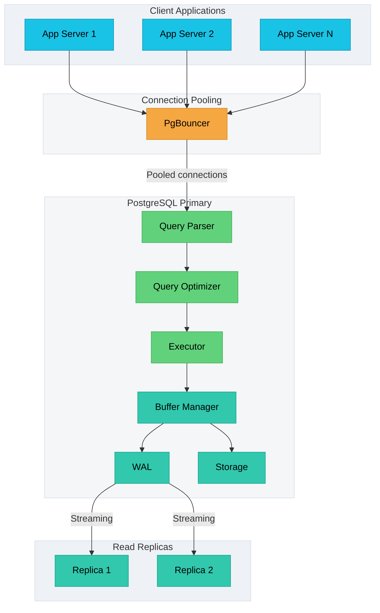

---
title: "PostgreSQL Deep Dive"
date: 2026-10-05 14:08:18 +05:30
categories: [BLOG]
tags: []
---
## PostgreSQL

- Strong default for the system of record.

>> Provides transactions, constraints, joins, mature indexing and enough extensibility to handle many product requirement without adding another data store.

## Deep Dive Concepts

1. Payment flows needs correct `isolation` and `idempotency`
2. JSONB fields need the right indexes
3. Large tables need partitioning choices tied to `query patterns`
4. Read replicas help read throughput but introduces `replication lag` and `failover` questions.

## PostgreSQL Architecture

## ACID Transactions Deep Dive

### Isolation Levels

### Handling Serialization Failures

### Select For Update (Row Level Lock)

### MVCC and VACUUM

## Indexing Strategies

1. B-Tree Index
2. Hash Index
3. GIN Index
4. GiST Index
5. BRIN Index
6. Composite Indexes
7. Partial Indexes
8. Covering Indexes

## Partitioning for Scale

1. Range Partitioning
2. List Partitioning
3. Hash Partitioning

### Partition Maintenance

### Partition Pruning

### Partitioning Limitations

## Replication and High Availability

1. Streaming Replication

    - Asych
    - Sync
    - Failover Strategy

2. Logical Replication
3. Read Scaling with Replicas

## Connection Pooling

## Common Patterns and Usecases

1. Optimistic Locking
2. Advisory Locks
3. UPSERT (Insert On Conflict)
4. Returning Clause
5. CTE's for Complex Queries
6. Prevent Double Booking
7. Audit Logging with Triggers

## Performance Optimization

1. EXPLAIN ANALYZE
2. Anti-Patterns
3. Performance Checklist

## Summary

- Use PostgreSQL when the system needs `relational queries, strong consistency, and room for requirements to evolve`. The main trade-offs are connection management, write scaling, vacuum/maintenance, and replica lag.

- Anchor the answer on four points: `transaction guarantees, query/index strategy, scaling plan, and failure handling`.
- Mention PgBouncer for connection pressure, replicas for read scaling, partitioning for large tables, and `retries when using Serializable isolation.`
